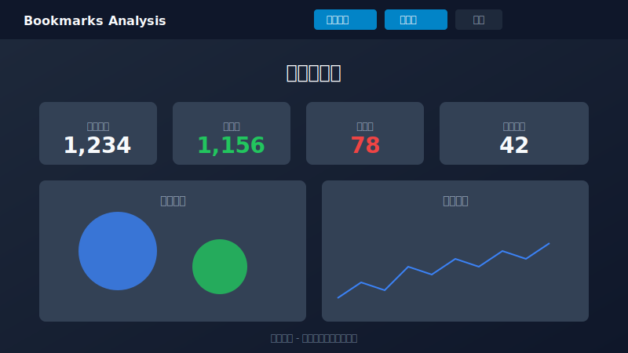
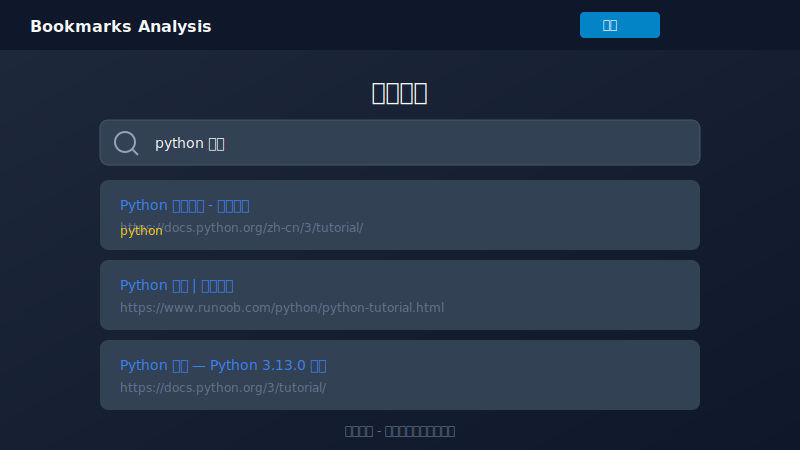
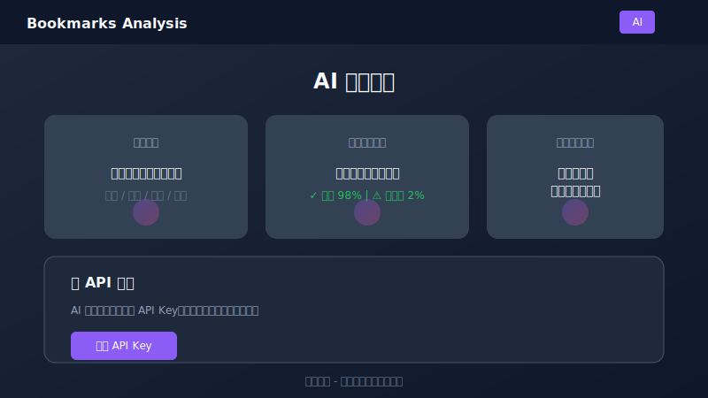

# Bookmarks Manager

<p align="center">
  <b>Merge, deduplicate, and analyze your browser bookmarks — privately and locally.</b>
</p>

<p align="center">
  <a href="https://lessup.github.io/bookmarks-manager/">
    
  </a>
</p>

<p align="center">
  <a href="https://github.com/LessUp/bookmarks-manager/releases/latest"></a>
  <a href="https://github.com/LessUp/bookmarks-manager/actions/workflows/ci.yml"></a>
  <a href="https://github.com/LessUp/bookmarks-manager/actions/workflows/pages.yml"></a>
  <a href="LICENSE"></a>
</p>

<p align="center">
  English | <a href="README.zh-CN.md">简体中文</a>
</p>

---

## 📖 Table of Contents

- [What is this?](#what-is-this)
- [Quick Start](#quick-start)
- [How to Use](#how-to-use)
- [Key Features](#key-features)
- [Privacy & Security](#privacy--security)
- [Screenshots](#screenshots)
- [For Developers](#for-developers)
- [Roadmap](#roadmap)
- [Changelog](#changelog)
- [License](#license)

---

## 🎯 What is this?

A **privacy-first, browser-based tool** that helps you:

- 📥 **Import** bookmarks from multiple browsers (Chrome, Firefox, Edge, Safari)
- 🔗 **Merge** them into one unified collection
- 🧹 **Remove duplicates** intelligently 
- 🔍 **Search** instantly with full-text search
- 📊 **Visualize** your bookmark habits
- 🤖 **Analyze** with AI (bring your own API key)

**All processing happens in your browser.** No data ever leaves your device.

---

## 🚀 Quick Start

### Option 1: Use Online (Recommended)

👉 **[Click here to open the app](https://lessup.github.io/bookmarks-manager/)**

No installation required. Works offline after first load (PWA).

### Option 2: Install as Desktop App

After opening the online version:

| Browser | Instructions |
|---------|-------------|
| Chrome/Edge | Click `⋮` → "Install Bookmarks Manager" |
| Safari | Share → "Add to Home Screen" |
| Firefox | Currently limited PWA support |

### Option 3: Run Locally

```bash
git clone https://github.com/LessUp/bookmarks-manager.git
cd bookmarks-manager
npm install
npm run dev
# Open http://localhost:5173
```

---

## 📖 How to Use

### 1. Export Bookmarks from Your Browser

**Chrome / Edge / Brave:**
1. Press `Ctrl+Shift+O` (Windows) or `Cmd+Shift+O` (Mac)
2. Click `⋮` menu → "Export bookmarks"
3. Save the HTML file

**Firefox:**
1. Press `Ctrl+Shift+B` (Windows) or `Cmd+Shift+B` (Mac)
2. Click "Import and Backup" → "Export Bookmarks to HTML"

**Safari:**
1. File → "Export Bookmarks"

### 2. Import & Merge

1. Open the [app](https://lessup.github.io/bookmarks-manager/)
2. Drag and drop your bookmark file(s) into the upload area
3. Click "Merge & Deduplicate"
4. Watch the magic happen ✨

### 3. Explore Your Bookmarks

- **Dashboard** — View stats, charts, and trends
- **Search** — Find bookmarks with instant full-text search
- **Duplicates** — Review what was deduplicated
- **AI** — Analyze with AI (optional, BYOK)
- **Export** — Download clean bookmarks back to your browser

---

## ✨ Key Features

| Feature | Description |
|---------|-------------|
| 🔒 **100% Private** | Everything runs locally in your browser. No server, no uploads, no tracking. |
| 🔗 **Smart Deduplication** | URL normalization removes true duplicates (handles http/https, trailing slashes, tracking params) |
| 📥 **Multi-Browser** | Merge bookmarks from Chrome, Firefox, Edge, Safari in one go |
| 🔍 **Full-Text Search** | Search across titles, URLs, and folder names with instant results |
| 📊 **Visual Insights** | See your bookmark patterns: top domains, yearly trends, duplicates ratio |
| 💾 **Auto-Save** | Data persists in browser storage — close the tab and come back later |
| 🤖 **AI Analysis** | Optional AI features (BYOK) for categorization, summarization, and insights |
| 📱 **PWA Support** | Install as a desktop/mobile app, works offline |
| 📤 **Multi-Format Export** | Export as HTML, JSON, CSV, or Markdown |
| 💾 **Backup & Restore** | Full application data backup and migration |

### Performance Benchmarks

| Metric | Performance |
|--------|-------------|
| Initial Load | < 2s |
| Search (10k bookmarks) | < 100ms |
| Import 1000 bookmarks | < 3s |
| Memory Usage | < 200MB |

---

## 🔒 Privacy & Security

Your bookmarks are precious. We take privacy seriously:

- ✅ **Zero Cloud** — No backend server, no database
- ✅ **Local Processing** — All parsing, merging, and analysis happens in your browser
- ✅ **No Uploads** — Your bookmarks never leave your device
- ✅ **Secure Storage** — Data stored in browser's IndexedDB (your control)
- ✅ **Open Source** — Full transparency. Inspect the code yourself.

**AI Features (Optional):**
- Uses your own API key (BYOK — Bring Your Own Key)
- API keys stored locally in your browser
- Can be used entirely offline without AI

---

## 📸 Screenshots

### Dashboard

*Visual analytics showing bookmark distribution, yearly trends, and duplicate statistics.*

### Search & Deduplication

*Instant full-text search across titles, URLs, and folders with duplicate detection.*

### AI Analysis

*AI-powered categorization, link health checking, and natural language bookmark search.*

> 💡 **Want to see it in action?** [Try the live demo](https://lessup.github.io/bookmarks-manager/)

---

## 🛠️ For Developers

Want to contribute or self-host? Check out:

- [CHANGELOG.md](CHANGELOG.md) — Version history and release notes
- [QUICKSTART.md](QUICKSTART.md) — Detailed development setup
- [FEATURES.md](FEATURES.md) — Full feature documentation
- [docs/ARCHITECTURE.md](docs/ARCHITECTURE.md) — System architecture
- [docs/API.md](docs/API.md) — Module interfaces
- [docs/CONTRIBUTING.md](docs/CONTRIBUTING.md) — Contribution guidelines
- [docs/PRD.md](docs/PRD.md) — Product requirements

```bash
# Development
npm install
npm run dev

# Build
npm run build

# Test
npm run test
```

**Tech Stack:** React 18 + TypeScript + Vite + Tailwind CSS + Dexie (IndexedDB) + ECharts

---

## 🗺️ Roadmap

### ✅ Completed (v1.1.0)
- Multi-format export (JSON, CSV, Markdown)
- Backup & restore functionality
- Web Worker optimization for large datasets
- Virtual scrolling
- AI module (BYOK)
- Documentation internationalization

### 📋 Planned (v1.2.0)
- Batch editing and tagging system
- Advanced filtering UI improvements
- Plugin system for custom exporters

### 🔮 Future (v2.0)
- Cloud sync (optional, end-to-end encrypted)
- Mobile app (React Native)

---

## 📝 Changelog

See [CHANGELOG.md](CHANGELOG.md) for a complete list of changes.

**Latest Release: v1.1.0** (2026-04-15)
- Multi-format export (JSON, CSV, Markdown)
- Backup & restore
- Performance optimizations
- Documentation restructuring with bilingual support

---

## 📄 License

[MIT License](LICENSE) — Free for personal and commercial use.

---

<p align="center">
  <sub>Built with ❤️ for bookmark hoarders everywhere</sub>
</p>

<p align="center">
  <a href="https://github.com/LessUp/bookmarks-manager">GitHub</a> •
  <a href="https://lessup.github.io/bookmarks-manager/">Live Demo</a> •
  <a href="docs/">Documentation</a>
</p>
